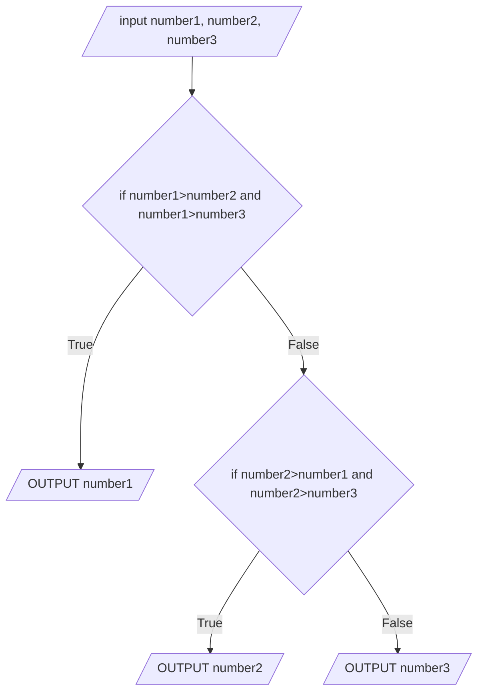

2. An algorithm is _a procedure used for solving a problem or performing a computation_.
3.  Abstraction is removing unnecessary detail from a problem in order to focus on the parts of the problem that need solving.
4. Analysis, Design, Coding, Testing
5. problem identification, breaking down the problem into smaller sub-problems, solving each sub-problem individually, integrating all the solutions to form the complete solution for the original problem.

