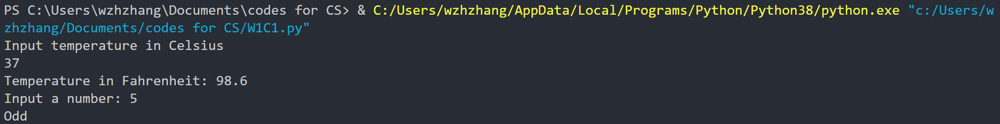

```
# Activity 2
cel = float(input("Input temperature in Celsius\n"))
far = cel*1.8+32
print("Temperature in Fahrenheit:", round(far))

# Activity 3
num = int(input("Input a number: "))
print("Odd" if num%2 else "Even")
```




